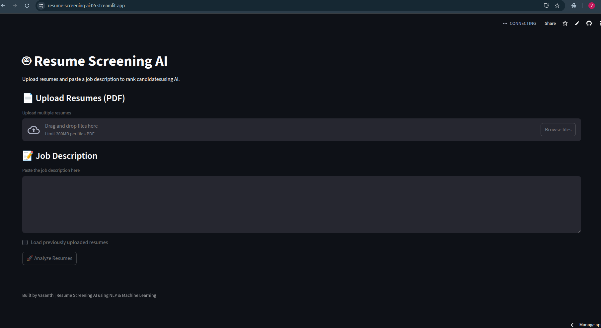
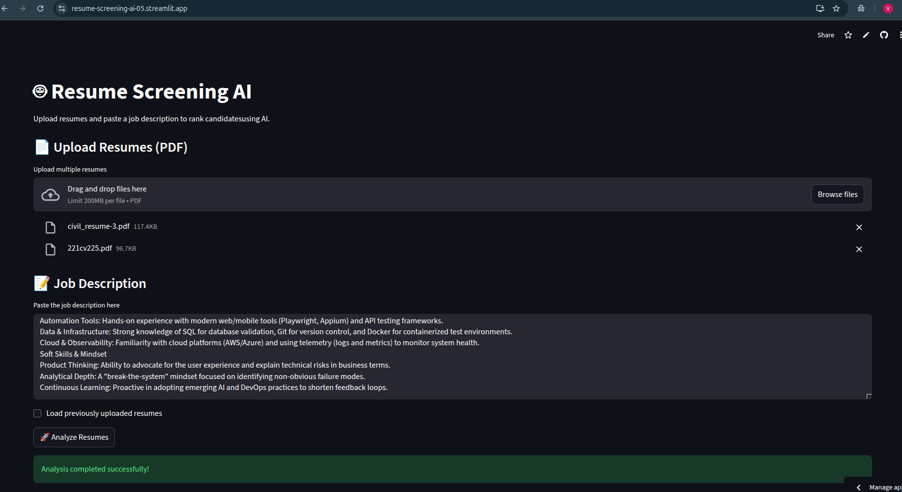
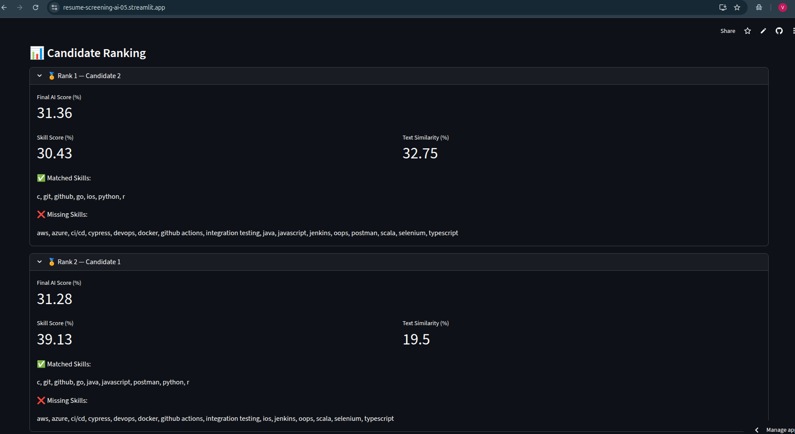

# 🤖 Resume Screening AI (Mini ATS)

An AI-powered **Applicant Tracking System (ATS)** that automatically parses resumes,
extracts skills, compares them with a job description, and ranks candidates using
NLP and Machine Learning techniques.

This project simulates how real-world ATS platforms shortlist candidates
before human review.

---

## 🚀 Live Demo
👉 https://resume-screening-ai-05.streamlit.app/

---

## 📌 Features
- 📄 Upload multiple resumes (PDF)
- 🧠 Resume text extraction
- 🧩 Skill extraction using a curated skill taxonomy
- 📊 Resume ↔ Job Description matching
- 📈 Candidate ranking with final AI score
- 🗂️ Local database persistence (SQLite)
- 🌐 Deployed Streamlit web application

---

## 🧠 Technologies Used

| Category | Tools |
|--------|-------|
Programming Language | Python |
Web Framework | Streamlit |
NLP | TF-IDF, Cosine Similarity |
ML Library | Scikit-learn |
Database | SQLite |
PDF Parsing | PyPDF2 |
Text Processing | NLTK |

---

## 🏗️ System Architecture
Resume PDF → Text Extraction → Skill Matching
↓
Job Description → NLP Similarity (TF-IDF)
↓
Final Score → Ranking → Recruiter View


---

## 📂 Project Structure

resume-screening-ai/
├── app.py # Streamlit application entry point
├── requirements.txt # Python dependencies
├── .gitignore # Git ignore rules
│
├── src/
│ ├── resume_parser.py # PDF → text extraction logic
│ ├── skill_extractor.py # Skill taxonomy & matching
│ ├── matcher.py # Resume–JD scoring and ranking
│ └── database.py # SQLite database operations


Copy code


---

## 🏷️ Badges


---

## 📸 Screenshots





---


## 👤 Author

**Vasanth Kandolu**  
B.Tech, National Institute of Technology Karnataka  
Aspiring Software Engineer  

🔗 GitHub: https://github.com/vasantharaju2004


---

## ▶️ Run Locally

```bash
git clone https://github.com/vasantharaju2004/resume-screening-ai.git
cd resume-screening-ai
pip install -r requirements.txt
streamlit run app.py
